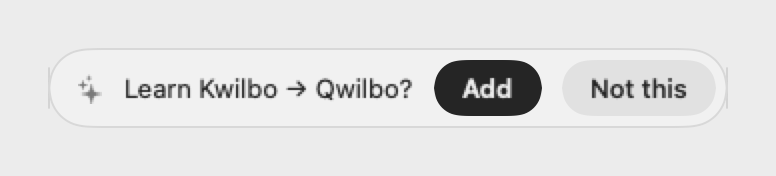
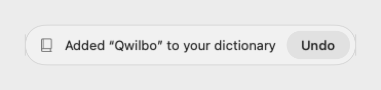
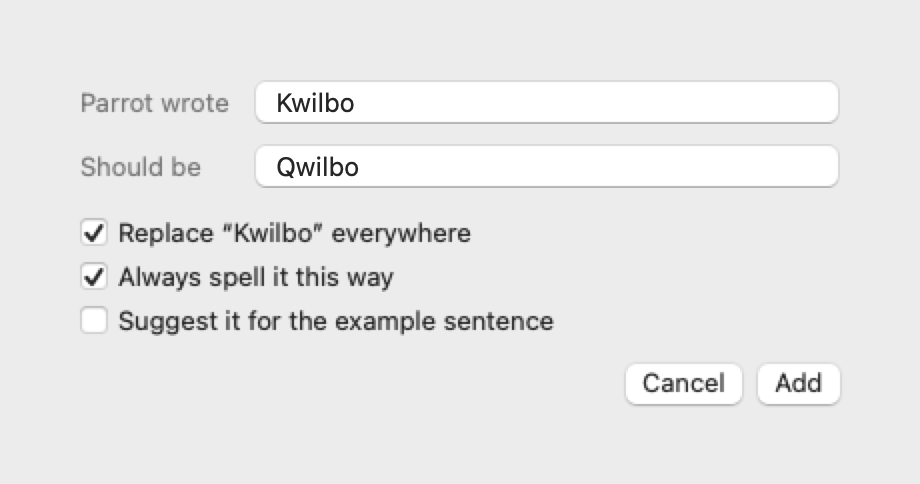
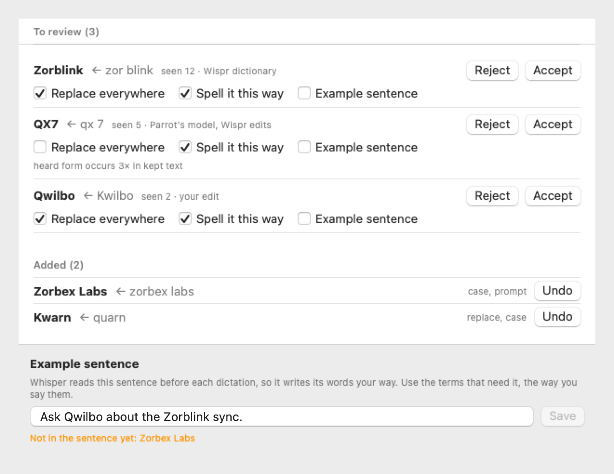
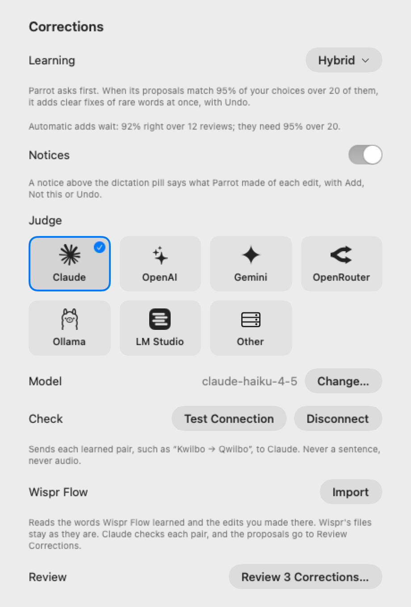
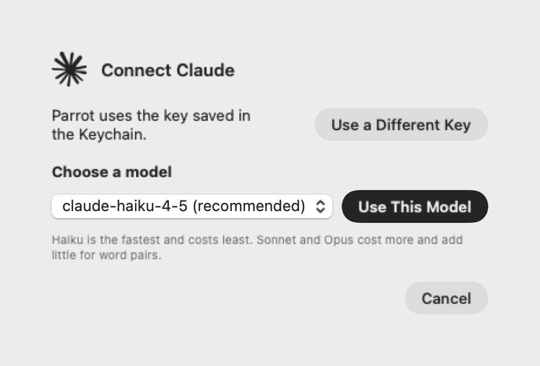

<p align="center">
  <picture>
    <source media="(prefers-color-scheme: dark)" srcset="docs/assets/icon-dark.png">
    
  </picture>
</p>

# parrot

Hold `fn`, speak, release. Your words appear at the cursor. On-device dictation for macOS.

> **This is a fork** of [Parrot by Humanitas Labs](https://github.com/humanitas-labs/parrot). It learns the spellings you correct, imports what Wispr Flow learned, and can ask an LLM of your choice to check what it learns. It has its own bundle ID (`io.github.riturajtiwari.parrot`) and no automatic updates.

## What this fork adds

### It learns your spellings

Fix a word that Parrot misheard, and a notice above the dictation pill asks whether to learn it. After Parrot has matched your choices for a while, it adds clear fixes on its own, with Undo.

<picture>
  <source media="(prefers-color-scheme: dark)" srcset="docs/assets/screenshots/notice-ask-dark.png">
  
</picture>

<picture>
  <source media="(prefers-color-scheme: dark)" srcset="docs/assets/screenshots/notice-added-dark.png">
  
</picture>

It follows your edits in TextEdit, Notes, Mail, Messages, Safari, Chrome, Slack, Outlook and the Claude app. It never reads keystrokes, and it never follows a password field.

### Fix Word…

Select a misheard word in any app, then choose **Fix Word…** in the Parrot menu, or **Services → Fix Word in Parrot**, which can have a keyboard shortcut.

<picture>
  <source media="(prefers-color-scheme: dark)" srcset="docs/assets/screenshots/fix-word-dark.png">
  
</picture>

### Review Corrections

Every proposal waits here with its rules: replace the misheard form everywhere, keep the spelling, or add the word to the example sentence that Whisper reads before each dictation. Undo takes back anything Parrot added.

<picture>
  <source media="(prefers-color-scheme: dark)" srcset="docs/assets/screenshots/review-dark.png">
  
</picture>

### Wispr Flow import

**Settings → Corrections → Import** reads the words Wispr Flow learned and the edits you made there, without changing Wispr's files, and puts the safe proposals in Review Corrections.

### An optional LLM judge

Click a provider in **Settings → Corrections**. Claude, OpenAI and Gemini need an API key: Parrot opens the page that makes one and picks the key up when you copy it. OpenRouter signs you in. Ollama and LM Studio run on your Mac. Parrot suggests the smallest model and tests it before it saves it.

<picture>
  <source media="(prefers-color-scheme: dark)" srcset="docs/assets/screenshots/settings-corrections-dark.png">
  
</picture>
<picture>
  <source media="(prefers-color-scheme: dark)" srcset="docs/assets/screenshots/connect-model-dark.png">
  
</picture>

The judge gets word pairs only, never a sentence or audio. Without one, nothing leaves your Mac. See [docs/corrections.md](docs/corrections.md) and [ADR-006](docs/decisions/006-learned-corrections.md).

## 1. Install

1. If you use the original Parrot, quit it and move it to the Trash. The two share their settings and can't run at the same time.
2. Download the disk image from the [latest release](https://github.com/riturajtiwari/parrot/releases/latest), open it, and drag Parrot to Applications.
3. Open Parrot. macOS blocks it the first time, because Apple has not notarized this build. Open **System Settings → Privacy & Security**, scroll down, and click **Open Anyway**.
4. In the setup window, allow the microphone and Accessibility. The first start downloads the speech model (about 150 MB).

Requires macOS 14+ on Apple Silicon. There are no automatic updates: get the next version from the releases page. To build it yourself, see [section 6](#6-build-from-source).

## 2. Usage

1. Click into any text field.
2. Hold `fn` and speak. A small pill at the bottom of the screen shows the mic is live. On a keyboard where `fn` does nothing (Logitech and most third-party keyboards), choose another key under **Hotkey** in **Settings…**: left or right Option, Command, Control, or Shift. The change applies from the next press.
3. Release. The transcript is pasted at the cursor, usually within 200–300 ms, and your clipboard is restored.

Choose **Launch at login** in **Settings…** to start Parrot with your Mac. A tap shorter than 0.3 s, or a hold with another modifier, is ignored, so shortcuts on the hotkey still work. If `fn` is mapped to input source or emoji, `parrot doctor` shows how to fix it.

To dictate in another language, choose a multilingual model in Settings (⌘, from the menu), then either one Language or Automatic. Automatic detects which of the languages under **Languages** each dictation is in, and never picks one you haven't listed. The list starts as your Mac's languages.

## 3. Dictionary

Add your names and technical terms to `~/.config/parrot/dictionary`, a plain-text table of each word and what the model writes instead, and Parrot spells them your way. **Open Dictionary File** in Settings opens it, and **Fix Word…** adds a row for you. Edits apply on the next dictation. See [docs/dictionary.md](docs/dictionary.md).

## 4. CLI

| Command | What it does |
|---|---|
| `parrot` | Run in the foreground (^C to quit) |
| `parrot setup` | One-time setup: permissions and model download |
| `parrot doctor` | Check permissions, and the `fn` key setting when the hotkey is `fn` |
| `parrot install --launch-at-login` | Start Parrot at login |
| `parrot install --cli` | Link `/usr/local/bin/parrot` to Parrot.app |
| `parrot install --uninstall` | Stop launching at login and remove logs |
| `parrot models list` | List available models |
| `parrot --model whisper-large-v3-turbo` | Larger, multilingual model |
| `parrot --hotkey right-option` | Use another key for this run only; Settings… changes the saved key |
| `parrot --no-overlay` | Hide the recording pill |
| `parrot --inject-mode type-unicode` | Type instead of paste (leaves the clipboard alone) |
| `parrot import wispr` | Show what Parrot would learn from Wispr Flow; `--apply` asks about each proposal |
| `parrot corrections list` | List learned corrections and their status |
| `parrot corrections undo <word>` | Remove what Parrot added for a word |
| `parrot llm set-key <provider>` | Save a provider's API key in the Keychain |
| `parrot llm test` | Ask the judge about made-up word pairs |

## 5. How it works

WhisperKit runs Whisper on the Apple Neural Engine via CoreML, AVAudioEngine captures the mic, a CGEventTap watches the hotkey, and a synthesized ⌘V pastes the result. Nothing leaves your Mac unless you connect an LLM judge, which gets word pairs only, and logs never contain what you said. See [docs/architecture.md](docs/architecture.md).

## 6. Build from source

```sh
swift build -c release && swift test
scripts/dev-install.sh      # build, sign, install Parrot.app, link the CLI
```

This fork signs with a Developer ID or, without one, a free Apple Development certificate, so the Microphone and Accessibility grants survive rebuilds. To make the certificate, open Xcode → **Settings → Accounts**, add your Apple ID, select your **Personal Team**, click **Manage Certificates…**, and add **Apple Development**. If `security find-identity -v -p codesigning` then finds no valid identity, the Mac lacks Apple's WWDR G3 intermediate certificate. Xcode ships a copy:

```sh
security import /Applications/Xcode.app/Contents/SharedFrameworks/DVTFoundation.framework/Versions/A/Resources/AppleWWDRCA-2030.cer -k ~/Library/Keychains/login.keychain-db
```

When `/usr/local/bin` is not writable, `PARROT_LINK_DIR=~/.local/bin scripts/dev-install.sh` links the command there, with no `sudo`.

The screenshots in this README come from `swift run parrot-bench screenshots`, which draws the windows off-screen with made-up words, in light and dark.

## 7. License

[MIT](LICENSE)
